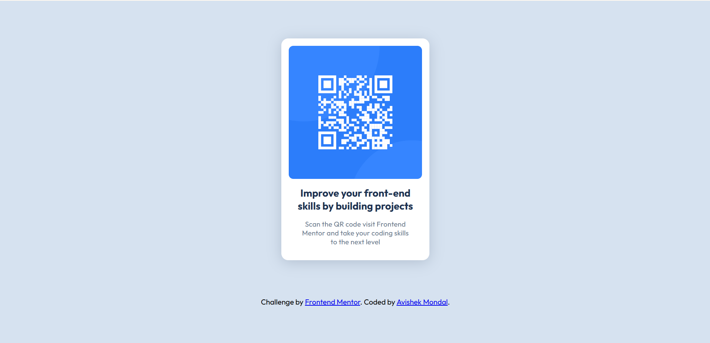
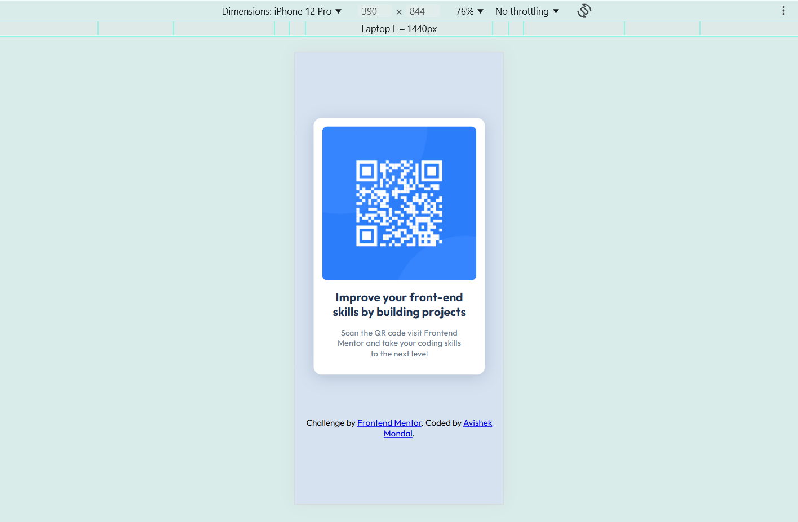

# Frontend Mentor - QR code component solution

This is a solution to the [QR code component challenge on Frontend Mentor](https://www.frontendmentor.io/challenges/qr-code-component-iux_sIO_H). Frontend Mentor challenges help you improve your coding skills by building realistic projects. 

## Table of contents

- [Overview](#overview)
  - [Screenshot](#screenshot)
  - [Links](#links)
- [My process](#my-process)
  - [Built with](#built-with)
  - [What I learned](#what-i-learned)
  - [Continued development](#continued-development)
- [Author](#author)
- [Acknowledgments](#acknowledgments)

## Overview

### Screenshot

### Links

- Solution URL: [Github link](https://github.com/Avizaz040/Web-dev-practice.git)

## My process

- First make website structure using html.
- I used main and div tag as a container.
- Used display type flex to align the image and text.
- Maintain the exact size of gap between every element as per figma file.
 

### Built with

- Semantic HTML5 markup
- CSS custom properties
- Flexbox

### What I learned

- How to align a image under a flex box.
- How to use the google fonts in a web page.

### Continued development

I want to do some project where the responsiveness is necessary in a web page, this type of projects helps me to learn "how make a responsive web site in different devices".

## Author

- Website - [Avishek Mondal]
- Frontend Mentor - [@Avizaz040](https://www.frontendmentor.io/profile/Avizaz040)

## Acknowledgments

This project can helps to all frontend learner to enhance there skill on alignment using css.
